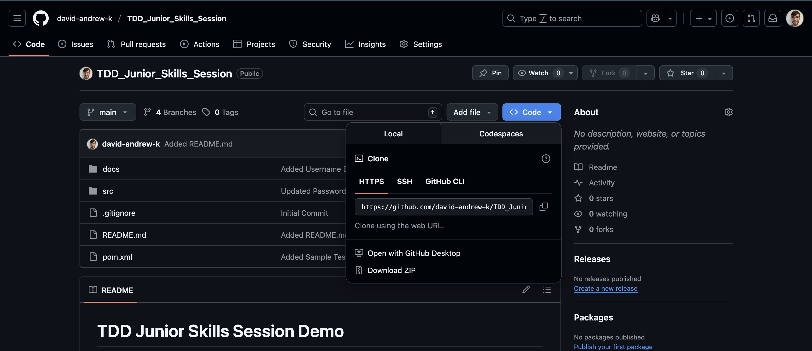

# Project Setup Instructions

This document provides step-by-step instructions for setting up the project environment, including installing necessary software, configuring settings, and running the project for the first time.

This is an opinionated guide, covering simple setup aimed at someone who is not familiar with the tools used in this project.

## IDE Installation

1. **Download and Install IntelliJ IDEA Community Edition**:
   - Go to the [IntelliJ download page](https://www.jetbrains.com/idea/download/).
   - Scroll down to the "Community" section, select the appropriate installer and click the "Download" button.
   - Follow the installation instructions provided on the website and via the installer.
    

2. **Download the source code for this project from the repository.**
   - You can clone the repository using Git or download it as a ZIP file and extract it to your desired location.
   - Click the "Code" button on the repository page and then select "Download ZIP". Alternatively, you can click [this link.](https://github.com/david-andrew-k/TDD_Junior_Skills_Session/archive/refs/heads/main.zip)
   - If you downloaded a ZIP file, extract it to a folder of your choice.
   
