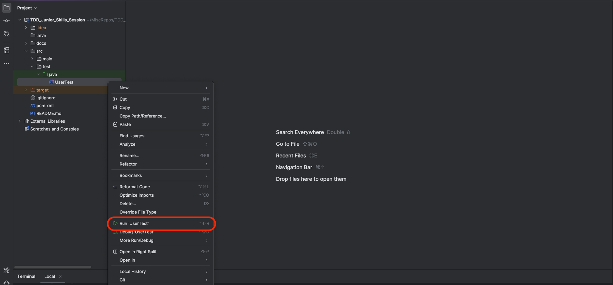

# Project Setup Instructions

This document provides step-by-step instructions for setting up the project environment, including installing necessary software, configuring settings, and running the project for the first time.

This is an opinionated guide, covering simple setup aimed at someone who is not familiar with the tools used in this project.

If you prefer a less traditional approach, you can refer to the [Project Setup AI Prompt](ProjectSetupAIPrompt.md) to generate your own instructions and ask follow-up questions using a Generative AI chatbot of your choice (e.g., ChatGPT, Copilot, etc.).

## IDE Installation and Setup

1. **Download and Install IntelliJ IDEA Community Edition**:
   - Go to the [IntelliJ download page](https://www.jetbrains.com/idea/download/).
   - Scroll down to the "Community" section, select the appropriate installer and click the "Download" button.
   - Follow the installation instructions provided on the website and via the installer.
    

2. **Download the source code for this project from the repository.**
   - You can clone the repository using Git or download it as a ZIP file and extract it to your desired location.
   - Click the "Code" button on the repository page and then select "Download ZIP". Alternatively, you can click [this link.](https://github.com/david-andrew-k/TDD_Junior_Skills_Session/archive/refs/heads/main.zip)
   - If you downloaded a ZIP file, extract it to a folder of your choice.
   

3. **Open the project in IntelliJ IDEA**:
   - Launch IntelliJ IDEA.
   - Click on "Open" from the welcome screen (or "File" > "Open" if you have another project open).
   - Navigate to the directory where you downloaded or cloned the project, select the project folder, and click "OK".

4. **Install and Select a Java Development Kit (JDK)**:
    - In IntelliJ, go to "File" > "Project Structure".
    - Under "Project Settings" and "Project", select the "SDK" drop down and select "Download JDK".
    - Download a Java 24 JDK or later (I recommend using Oracle OpenJDK).
    - Under "Project Settings", select "Project" and set the "Project SDK" to the JDK you just downloaded (if this is not done automatically.).

5. **Test that your project compiles**:
    - Right click on "src/main/java/org/dwa/Main.java" file and select "Run 'Main.main()'".
    - You should see "TDD Demo is working as expected!" printed in the Run window at the bottom of the screen.
      

6. **Run the tests**:
   - Right click on "src/test/java/org/dwa/UserTest.java" file and select "Run 'UserTest'".
   - You should see that there is single test that should pass (green tick) in the Run window at the bottom of the screen.
     

**That's it! You have successfully set up the project environment and can now start working on the project.**

